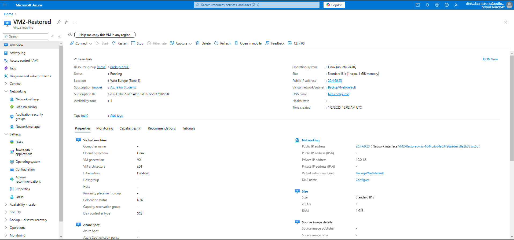

# Azure Backup and Recovery Lab
---
**A Hands-on Lab for Configuring and Restoring Virtual Machine Backups in Azure**
---

This project demonstrates how to configure Azure Backup to protect Virtual Machines (VMs) and restore them from recovery points to ensure business continuity. The lab includes setting up a Recovery Services Vault, configuring backup policies, performing VM backups, and testing restored VM functionality.

---

## Table of Contents
1. [Project Objectives](#project-objectives)
2. [Steps Implemented](#steps-implemented)
3. [Screenshots](#screenshots)
4. [Tools Used](#tools-used)
5. [Useful Links](#useful-links)
6. [License](#license)
7. [Contributions](#contributions)

---

## Project Objectives

- **Set up a Recovery Services Vault**  
  Create and configure a Recovery Services Vault to centrally manage VM backups.

- **Create Backup Policies**  
  Define automated backup policies for virtual machines, including frequency and retention periods.

- **Perform Manual and Scheduled Backups**  
  Execute both on-demand and scheduled backups for Azure virtual machines.

- **Restore Virtual Machines**  
  Recover VMs from previously created recovery points using the Azure Portal.

- **Test Connectivity and Functionality**  
  Validate the restored VMs by testing network connectivity and ensuring application functionality.

---

## Steps Implemented
1. **Create a Resource Group**  
   - Name: `BackupLabRG`  
   - Region: West Europe

2. **Create a Storage Account**  
   - Type: Standard  
   - Name: `backupstorageaccttest`

3. **Set Up a Recovery Services Vault**  
   - Name: `BackupVault`  
   - Associated Resource Group: `BackupLabRG`

4. **Configure Backup Policy**  
   - Frequency: Daily backup at 11:00 PM  
   - Retention: 180 days

5. **Backup Virtual Machines**  
   - VMs: `VM1-Backup`, `VM2-Backup`

6. **Restore a Virtual Machine**  
   - Type: Create a new VM  
   - Restored VM name: `VM2-Restored`

---

## Screenshots

Below are the screenshots that illustrate the steps:

1. **Backup Items Overview**  
     
   *Overview of backup items configured in the Recovery Services Vault.*

2. **Trigger Backup Now**  
     
   *Initiating a manual backup operation for the VM.*

3. **Backup Policy Creation**  
     
   *Creating a custom backup policy with defined retention and frequency.*

4. **Recovery Vault Creation**  
     
   *Configuring the Recovery Services Vault.*

5. **Resource Group Creation**  
     
   *Resource group used to organize Azure resources.*

6. **Restore Configuration**  
     
   *Configuring restoration parameters for the VM.*

7. **Restored VM Overview**  
     
   *Overview of the VM after being restored from a backup.*

8. **Restore Job Progress**  
     
   *Monitoring the progress of the restoration process.*

9. **Select VMs for Backup**  
     
   *Selecting VMs to include in the backup policy.*

10. **Storage Account Creation**  
      
    *Storage account used for additional configurations.*

11. **Restored VM with Public IP**  
      
    *Verification of the restored VM's public IP address.*

12. **SSH Login to Restored VM**  
      
    *Successful SSH connection to the restored VM.*

13. **VMs Overview**  
      
    *Overview of all VMs configured in the resource group.*

---

## Tools Used
- **Azure Portal**: For VM backup and recovery configuration.  
- **SSH**: For connecting to restored VMs.  
- **PowerShell**: For command-line operations.

---

## Useful Links

- [Azure Backup Documentation](https://learn.microsoft.com/en-us/azure/backup/)  
  Comprehensive guide to configuring and using Azure Backup.

- [Azure Recovery Services Vault Documentation](https://learn.microsoft.com/en-us/azure/backup/backup-azure-recovery-services-vault-overview)  
  Details about Recovery Services Vaults and their capabilities.

- [Azure Storage Account Overview](https://learn.microsoft.com/en-us/azure/storage/common/storage-account-overview)  
  Learn about Azure Storage Accounts and their types.

- [SSH Basics](https://www.ssh.com/academy/ssh)  
  A beginner's guide to secure remote access using SSH.

---

## License

This project is licensed under the [MIT License](./LICENSE).  
See the LICENSE file for detailed terms and conditions.

---

## Contributions

Contributions are welcome!  
If you have suggestions for improvements or additional use cases, feel free to [fork this repository](https://github.com/dinAlexDu/Azure-Backup-and-Recovery-Lab) and submit a pull request.  

Please adhere to our [Code of Conduct](./CODE_OF_CONDUCT.md) when contributing to this project.
