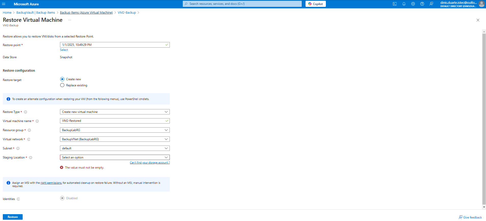

# Azure Backup and Recovery Lab
---
A Hands-on Lab for Configuring and Restoring Virtual Machine Backups in Azure
---
This project demonstrates how to configure Azure Backup to protect Virtual Machines (VMs) and restore them from recovery points to ensure business continuity. The lab includes setting up a Recovery Services Vault, configuring backup policies, performing VM backups, and testing restored VM functionality.

---
# Table of Contents
1. [Project Objectives](#project-objectives)
2. [Steps Implemented](#steps-implemented)
3. [Screenshots](#screenshots)
4. [Tools Used](#tools-used)
5. [Useful Links](#useful-links)
6. [License](#license)
7. [Contributions](#contributions)

## 🛠️ Project Objectives

- **Set up a Recovery Services Vault**  
  Create and configure a Recovery Services Vault to centrally manage VM backups.

- **Create Backup Policies**  
  Define automated backup policies for virtual machines, including frequency and retention periods.

- **Perform Manual and Scheduled Backups**  
  Execute both on-demand and scheduled backups for Azure virtual machines.

- **Restore Virtual Machines**  
  Recover VMs from previously created recovery points using the Azure Portal.

- **Test Connectivity and Functionality**  
  Validate the restored VMs by testing network connectivity and ensuring application functionality.

---

## ⚙️ Steps Implemented
1. Create a Resource Group
  - Name: BackupLabRG
  - Region: West Europe
2. Create a Storage Account
  - Type: Standard
  - Name: backupstorageaccttest
3. Set Up a Recovery Services Vault
  - Name: BackupVault
  - Associated Resource Group: BackupLabRG
4. Configure Backup Policy
  - Frequency: Daily backup at 11:00 PM.
  - Retention: 180 days.
5. Backup Virtual Machines
  - VMs: VM1-Backup, VM2-Backup
6. Restore a Virtual Machine
  - Type: Create a new VM.
  - Restored VM name: VM2-Restored.

---

## 🖼️ Screenshots

Below are the screenshots that illustrate the steps:

1. **Backup Items Overview**
   

2. **Trigger Backup Now**
   

3. **Backup Policy Creation**
   

4. **Recovery Vault Creation**
   

5. **Resource Group Creation**
   

6. **Restore Configuration**
   

7. **Restored VM Overview**
   

8. **Restore Job Progress**
   

9. **Select VMs for Backup**
   

10. **Storage Account Creation**
    

11. **Restored VM with Public IP**
    

12. **SSH Login to Restored VM**
    

13. **VMs Overview**
    

---

## 🛠️ Tools Used
  - Azure Portal: For VM backup and recovery configuration.
  - SSH: For connecting to restored VMs.
  - PowerShell: For command-line operations.

## 🌐 Useful Links

- [📖 Azure Backup Documentation](https://learn.microsoft.com/en-us/azure/backup/)  
  Comprehensive guide to configuring and using Azure Backup.

- [📂 Azure Recovery Services Vault Documentation](https://learn.microsoft.com/en-us/azure/backup/backup-azure-recovery-services-vault-overview)  
  Details about Recovery Services Vaults and their capabilities.

- [📦 Azure Storage Account Overview](https://learn.microsoft.com/en-us/azure/storage/common/storage-account-overview)  
  Learn about Azure Storage Accounts and their types.

- [🔐 SSH Basics](https://www.ssh.com/academy/ssh)  
  A beginner's guide to secure remote access using SSH.

## 📜 License

This project is licensed under the [MIT License](./LICENSE).  
See the LICENSE file for detailed terms and conditions.

---

## 🤝 Contributions

Contributions are welcome!  
If you have suggestions for improvements or additional use cases, feel free to [fork this repository](https://github.com/dinAlexDu/Azure-Backup-and-Recovery-Lab) and submit a pull request.  

Please adhere to our [Code of Conduct](./CODE_OF_CONDUCT.md) when contributing to this project.

